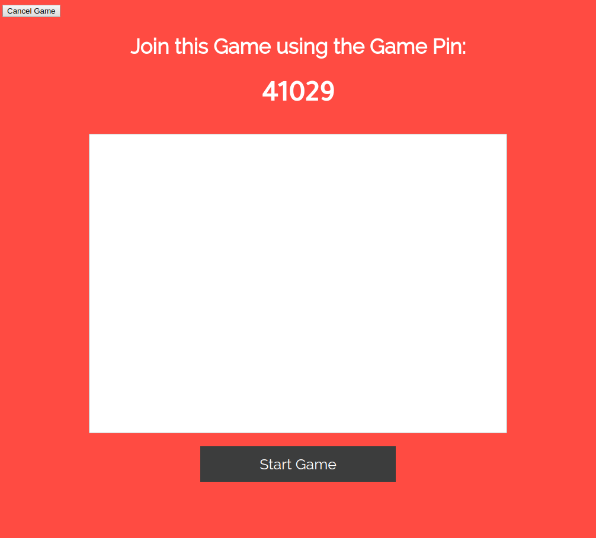

# kahoot-NodeJS
<h2>Welcome to Studyeze Frameworks 2.0</h2>
<h3>INSTRUCTIONS:</h3>
<ol>
  <li>Install MongoDB: 'Sudo apt-get install mongodb'</li>
  <li>Start MongoDB: 'Sudo service mongodb start'</li>
  <li>Make sure all node modules have been installed listed in package.json: express, moment, mongodb, mongoose, socket.io</li>
  <li>Start Server: nodejs server/server.js</li>
</ol>
 
<h3>Description</h3>
<h5>This project is a kahoot clone that uses nodejs and mongodb</h5>
<h5>Multiple games can be ongoing at one time and works with many players per game</h5>
<h3>Screen Shots:</h3>

<h3>This Project is Designed by Mohammad Saquib Khan</h3>
